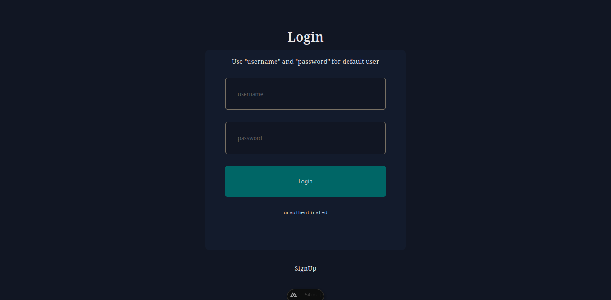
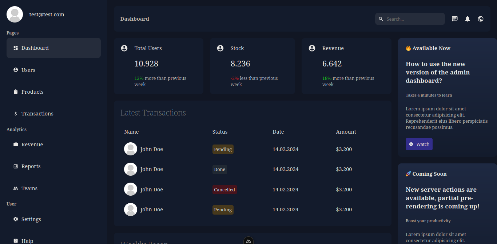
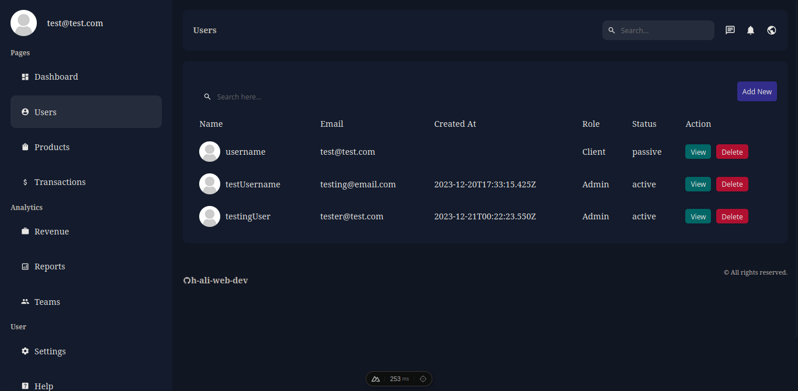
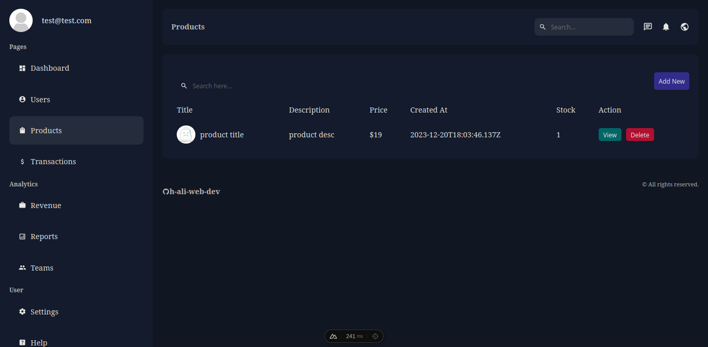

# Nuxt 3 & MongoDB Admin Dashboard

This is the Nuxt3 implementation of the admin dashboard app originally made in Next.js https://github.com/safak/nextadmin/tree/completed by : https://github.com/safak.

This App includes:

- user login and signup using Auth.js.
- CRUD operations for products.
- CRUD operations for users.
- graphs using plotly.js

# setup

use docker-compose.yml file to start the mongodb server. start the nuxt server and check if "Connected to MongoDB" is present in the console log.

use Bruno or Postman for API testing, all api tests are included in the "tests" directory. make sure to set "AUTH_BYPASS" to true in .env file to bypass auth for api testing purposes.

# screenshots

login page

dashboard

users dashboard

products dashboard

